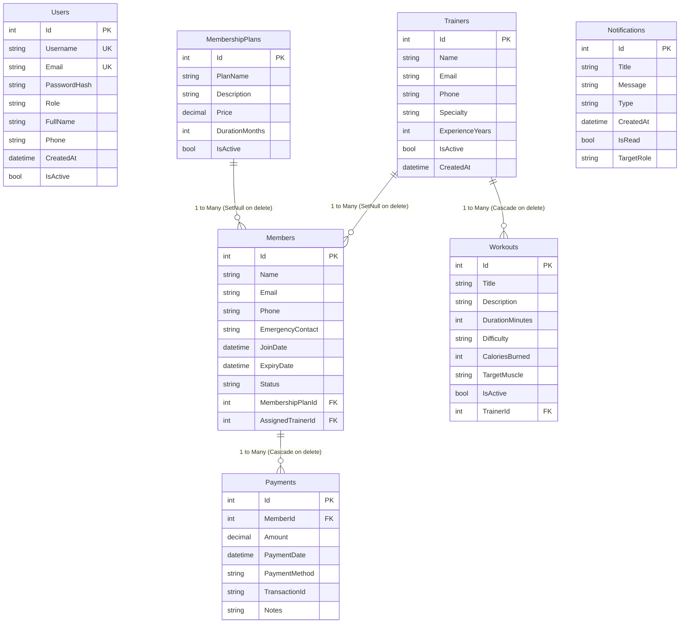

# FITCORE — Gym & Fitness Management System

> **A Commercial-Grade, Full-Stack .NET 8 & React Enterprise Management Platform for Fitness Centers, Health Clubs, and Athletic Gyms.**

---

## 1. Overview

**FITCORE** is an end-to-end, multi-tier gym management ecosystem developed using modern software engineering patterns. Built with an **ASP.NET Core 8 Web API** backend and a **React 19 + TypeScript** SPA frontend, FITCORE orchestrates member life cycles, trainer rosters, customizable membership plans, workout programming, recurring payments with invoice generation, analytics reporting, and real-time alerts.

The project demonstrates production-grade competencies in:
* **Clean Layered Architecture** (DAL, BLL, Presentation API, Client SPA)
* **Generic & Specific Repository Patterns** with asynchronous EF Core 9 operations
* **Service-Oriented Business Logic** with Data Transfer Objects (DTOs) and fluent validation
* **JWT Bearer Authentication & Role-Based Access Control (RBAC)** across `ADMIN`, `STAFF`, and `TRAINER` tiers
* **Relational Database Design** using Microsoft SQL Server with strict foreign keys, indexing, and precision modeling
* **Centralized Exception Handling Middleware** with standardized error envelopes
* **Responsive SaaS UI/UX** with dynamic dark/light theming, SVG analytical visualizations, and global keyboard search (`/`)

---

## 2. Key Features

### 🏋️ Member Management
* **Full Lifecycle Operations**: Create, update, view, and deactivate member accounts.
* **Intelligent Membership Status Engine**: Dynamically calculates `Active`, `Expiring Soon` (within 7 days), `Expired`, and `Inactive` states.
* **1-Click Renewal**: Extends membership duration, auto-generates payment ledger entries, and records system audit notifications.
* **360° Member Dossier**: Comprehensive tabs for Member Profile, Active Membership, Historical Payments, and Activity logs.

### 💳 Financial Ledger & Receipts
* **Transaction Recording**: Tracks payments across Cash, Credit Card, Mobile Banking, and Bank Transfer channels.
* **Strict Financial Validation**: Rejects negative or zero sums and enforces non-null member association.
* **Invoice Receipt Generator**: Printable, formatted receipts containing transaction IDs, timestamps, and club info.
* **Revenue Metrics**: Real-time aggregation of total revenue and current-month turnover.

### 📋 Membership Plans & Tiering
* **Dynamic Catalog**: Full CRUD management of membership durations (1, 3, 6, 12 months) and pricing tiers.
* **Zero Hardcoded Data**: All frontend pricing cards pull live from SQL Server.
* **Active Status Toggling**: Retire legacy tiers without breaking existing member foreign key history.

### ⚡ Workout & Training Engine
* **Workout Library**: Tracks exercises, targeted muscle groups, caloric burn rates, duration, and difficulty ratings (`Beginner`, `Intermediate`, `Advanced`).
* **Trainer Assignment**: Relational linkage between certified trainers and specialized routines.
* **Multi-Filter Discovery**: Filter routines by trainer, difficulty, or muscle group.

### 🧑‍🏫 Personal Trainer Directory
* **Trainer Profiles**: Specialty tracking, certified years of experience, direct contact info, and active status.
* **Workload Metrics**: Computes active member caseload and assigned training sessions.

### 📊 Real-Time Analytics & Reports
* **Executive Dashboard**: Top-level KPI counter cards (Total Members, Active Roster, Expired Members, Total Revenue).
* **SVG Visualizations**: Interactive Revenue Over Time charts and Membership Tier distributions.
* **CSV Export**: One-click download of revenue and roster reports for offline auditing.

### 🔔 System Notifications & Global Search
* **Automated Alerts**: System-triggered alerts for expiring plans, recorded payments, and roster changes.
* **Global Search (`/` Shortcut)**: Instant full-text search across members, trainers, plans, workouts, and transactions.

---

## 3. Technologies & Frameworks

| Domain | Technology | Purpose |
| :--- | :--- | :--- |
| **Backend Runtime** | .NET 8.0 (C# 12) | High-performance Web API runtime |
| **Data Access** | Entity Framework Core 9.0 | ORM with code-first migrations and LINQ queries |
| **Database** | Microsoft SQL Server (Local / Express) | Relational database engine |
| **Security** | BCrypt.Net-Next & System.IdentityModel.Tokens.Jwt | Cryptographic salt hashing & HMAC-SHA256 JWT tokens |
| **API Documentation** | Swashbuckle / Swagger OpenAPI | Interactive API sandbox with Bearer token authentication |
| **Frontend Framework** | React 19 & TypeScript | Declarative, strictly typed UI components |
| **Build Tool** | Vite 8 | Instant HMR development and optimized production bundling |
| **Icons** | Lucide React | Lightweight, accessible SVG icon library |
| **Styling** | Vanilla CSS Design System | Responsive layout tokens, glassmorphism, and HSL palettes |

---

## 4. Architecture & Design Patterns

FITCORE follows a strict, enterprise-compliant **Separation of Concerns (SoC)** model:

```
FITCORE Architecture
├── Presentation Layer (Client)
│   └── React 19 + TypeScript SPA (Vite)
│       └── Centralized API Service (`src/services/api.ts`)
│
├── API Gateway / Presentation Layer (Web API)
│   ├── Controllers (`gymandfitness/Controllers/*.cs`) - Thin HTTP adapters
│   ├── Middleware (`gymandfitness/Middleware/ExceptionMiddleware.cs`) - Error handling
│   └── Program.cs - Dependency injection & middleware pipeline
│
├── Business Logic Layer (BLL)
│   ├── Services (`BLL/Services/*.cs`) - Business rules, status calculations, JWT creation
│   └── DTOs (`BLL/DTOs/*.cs`) - Strong request/response contracts
│
└── Data Access Layer (DAL)
    ├── EF Core DbContext (`DAL/EF/ApplicationDbContext.cs`)
    ├── Entity Models (`DAL/EF/Models/*.cs`)
    ├── Repositories (`DAL/Repositories/*.cs`) - Generic & specific data queries
    └── Migrations (`DAL/Migrations/*.cs`) - Schema versioning
```

### Key Architectural Decisions
1. **Thin Controllers**: Controllers never execute business rules or database queries directly; they accept DTOs, delegate to BLL services, and return standard `IActionResult` responses.
2. **Repository Abstraction**: Repositories isolate EF Core dependencies (`IGenericRepository<T>`, `IMemberRepository`, `ITrainerRepository`, etc.), facilitating clean mocking and unit testing.
3. **DTO Decoupling**: Database entities are never returned raw to the client, preventing over-posting attacks and circular reference serialization loops.
4. **Asynchronous Non-Blocking I/O**: `async`/`await` is applied end-to-end through every controller, service, and repository method.

---

## 5. Database Schema & Entity Relationships



---

## 6. REST API Endpoints

### 🔐 Authentication (`/api/auth`)
* `POST /api/auth/register` — Register a new user account (Staff, Trainer, Admin).
* `POST /api/auth/login` — Authenticate credentials; returns user profile and signed JWT token.
* `GET  /api/auth/me` — Retrieve currently authenticated user profile `[Authorize]`.
* `PUT  /api/auth/profile` — Update account profile details `[Authorize]`.
* `POST /api/auth/change-password` — Change user password securely `[Authorize]`.

### 👥 Member Management (`/api/member`)
* `GET    /api/member` — List members with optional query filters (`search`, `status`, `planId`).
* `GET    /api/member/{id}` — Get single member dossier with nested payment ledger.
* `POST   /api/member` — Create member and optional initial payment.
* `PUT    /api/member/{id}` — Update existing member details.
* `DELETE /api/member/{id}` — Remove member account and cascade related payments.
* `POST   /api/member/{id}/renew` — Renew membership for specified months.
* `GET    /api/member/expired` — List all expired members.
* `GET    /api/member/expiring-soon` — List members expiring within 7 days.

### 📋 Membership Plans (`/api/membershipplan`)
* `GET    /api/membershipplan` — List all active plans.
* `GET    /api/membershipplan/{id}` — Get plan details.
* `POST   /api/membershipplan` — Create a new plan tier.
* `PUT    /api/membershipplan/{id}` — Update plan details.
* `DELETE /api/membershipplan/{id}` — Delete plan.
* `PATCH  /api/membershipplan/{id}/toggle-active` — Toggle plan visibility.

### 🧑‍🏫 Trainers (`/api/trainer`)
* `GET    /api/trainer` — List trainers with member counts and workout counts.
* `GET    /api/trainer/{id}` — Get trainer profile with assigned workouts and members.
* `POST   /api/trainer` — Add a new certified personal trainer.
* `PUT    /api/trainer/{id}` — Update trainer credentials.
* `DELETE /api/trainer/{id}` — Delete trainer profile.
* `PATCH  /api/trainer/{id}/toggle-active` — Toggle trainer active status.

### 🏋️ Workouts (`/api/workout`)
* `GET    /api/workout` — List workouts with filters (`search`, `difficulty`, `trainerId`).
* `GET    /api/workout/{id}` — Get workout routine by ID.
* `POST   /api/workout` — Create routine linked to trainer.
* `PUT    /api/workout/{id}` — Update routine.
* `DELETE /api/workout/{id}` — Delete routine.
* `GET    /api/workout/by-trainer/{trainerId}` — List routines by specific trainer.

### 💵 Payments (`/api/payment`)
* `GET  /api/payment` — Query financial ledger (`search`, `memberId`, `paymentMethod`, date range).
* `GET  /api/payment/{id}` — Retrieve receipt details.
* `POST /api/payment` — Record new payment transaction.
* `GET  /api/payment/by-member/{memberId}` — Query member payment history.
* `GET  /api/payment/stats` — Total and monthly revenue totals.

### 📈 Reports & Dashboard (`/api/reports`, `/api/dashboard`)
* `GET /api/dashboard/summary` — Aggregated KPI metrics for dashboard cards and charts.
* `GET /api/reports/revenue` — Periodic revenue summary breakdown.
* `GET /api/reports/growth` — Month-by-month member acquisition statistics.
* `GET /api/reports/trainers` — Trainer performance and member distribution.
* `GET /api/reports/expired-members` — Expired roster report.

### 🔔 Notifications & Search (`/api/notification`, `/api/search`)
* `GET   /api/notification` — Retrieve latest system notifications.
* `GET   /api/notification/unread-count` — Count of unread notifications.
* `PATCH /api/notification/{id}/read` — Mark single notification as read.
* `POST  /api/notification/mark-all-read` — Mark all notifications as read.
* `GET   /api/search?q={term}` — Global search across all entities.

---

## 7. Installation & Configuration

### Prerequisites
* **.NET 8.0 SDK** ([Download](https://dotnet.microsoft.com/download/dotnet/8.0))
* **Node.js (v18+) & npm** ([Download](https://nodejs.org/))
* **Microsoft SQL Server 2019+ or SQL Server Express**
* **Entity Framework Core CLI Tools**:
  ```powershell
  dotnet tool install --global dotnet-ef
  ```

---

## 8. Database Setup

1. Verify that your SQL Server instance is running:
   ```powershell
   # Windows Service Check
   Get-Service -Name "MSSQL$SQLEXPRESS"
   ```

2. Open `gyms/gymandfitness/appsettings.json` and ensure the connection string matches your local SQL Server instance:
   ```json
   {
     "ConnectionStrings": {
       "DefaultConnection": "Server=DESKTOP-4FCA5OE\\SQLEXPRESS;Database=gymdb;Trusted_Connection=True;TrustServerCertificate=True;"
     }
   }
   ```

3. Apply Entity Framework Core migrations:
   ```powershell
   cd c:\Users\USER\Downloads\gyms
   dotnet ef database update --project .\gyms\DAL\DAL.csproj --startup-project .\gyms\gymandfitness\gymandfitness.csproj
   ```

---

## 9. Running the Application

### Starting the Backend API
```powershell
cd c:\Users\USER\Downloads\gyms
dotnet run --project .\gyms\gymandfitness\gymandfitness.csproj --urls http://localhost:5079
```
* **REST API & Endpoints**: `http://localhost:5079`
* **Swagger UI Documentation**: `http://localhost:5079/swagger`

### Starting the Frontend Web App
```powershell
cd c:\Users\USER\Downloads\gyms\frontend
npm install
npm run dev
```
* **Web Application**: `http://localhost:3000`

---

## 10. Development Test Credentials

The database automatically initializes the following development accounts:

| Role | Username | Password | Access Rights |
| :--- | :--- | :--- | :--- |
| **ADMIN** | `admin` | `Admin@123` | Full enterprise administrative privileges |
| **STAFF** | `staff` | `Staff@123` | Member lifecycle, plan renewals, and payment recording |
| **TRAINER** | `trainer` | `Trainer@123` | Workout scheduling and assigned member tracking |

*(Note: Click any demo pill on the login page to automatically fill credentials.)*

---

## 11. License
This project is developed for educational and portfolio demonstration purposes.
