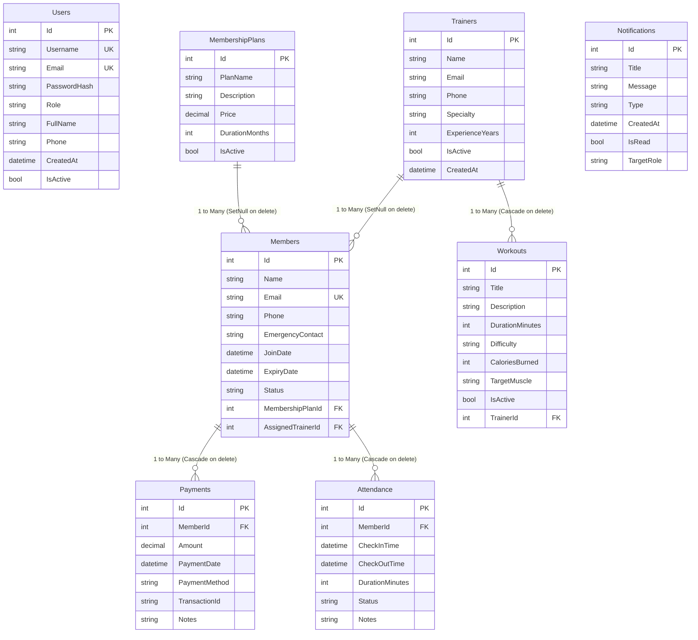

# FITCORE — Gym & Fitness Management System

> **A Commercial-Grade, Full-Stack .NET 8 & React Enterprise Management Platform for Fitness Centers, Health Clubs, and Athletic Gyms.**

---

## 1. Executive Summary & Overview

**FITCORE** is an end-to-end, multi-tier gym management ecosystem engineered with production-ready software architecture patterns. Built with an **ASP.NET Core 8 Web API** backend and a **React 19 + TypeScript** SPA frontend, FITCORE coordinates member lifecycles, real-time turnstile/front desk attendance tracking, trainer assignments, customizable membership plans, workout routine programming, financial transaction recording with printable invoice generation, analytical business reporting, and automated alerts.

The codebase showcases real-world, enterprise-level competencies:
* **Clean Layered Architecture**: Clear Separation of Concerns (Presentation, Business Logic, and Data Access layers).
* **Repository & Unit-of-Work Patterns**: Generic & specific asynchronous repository interfaces decoupling business logic from EF Core.
* **Service-Oriented Business Logic**: Decoupled Data Transfer Objects (DTOs) with defensive business rule validation.
* **Server-Side Pagination & Optimization**: Dynamic `PagedResult<T>` with SQL-level `CountAsync()`, `Skip()`, and `Take()` evaluation to eliminate memory bloat on large datasets.
* **JWT Bearer Authentication & Hardened RBAC**: Cryptographic token authentication with granular Role-Based Access Control (`ADMIN`, `STAFF`, `TRAINER`).
* **Relational Schema Modeling**: Microsoft SQL Server schema with normalized foreign key constraints, cascading policies, and index-optimized query paths.
* **Operational Health Diagnostics**: Direct `/health` monitoring endpoint assessing SQL Server engine connectivity and ping latency.
* **Centralized Error Envelope Pipeline**: Custom global middleware intercepting unhandled exceptions and emitting RFC 7807 problem details.
* **Responsive SaaS UI/UX**: Dark fitness aesthetic with glassmorphism, fluid mobile drawers, `@media print` paper receipt styles, and keyboard shortcuts (`/`).

---

## 2. Key Modules & Functional Capabilities

### 🏢 Real-Time Attendance Desk
* **Instant Check-In / Check-Out**: Rapid front desk processing with automated timestamp logging.
* **Floor Occupancy Counter**: Real-time KPI monitoring of active patrons currently in the facility.
* **Automated Duration Computation**: Calculates logged training duration in minutes upon checkout.
* **Membership Expiry Gating**: Automatically rejects check-ins for members with expired contracts or inactive profiles (`InvalidOperationException`).
* **Active Session Lock**: Prevents duplicate concurrent check-ins for patrons already on the floor.
* **Patron Attendance Ledger**: Comprehensive historical session logs per member.

### 🏋️ Member Management & Server-Side Pagination
* **Full Lifecycle Operations**: Create, update, view, and soft/hard deactivate member accounts.
* **Intelligent Membership Status Engine**: Dynamically calculates `Active`, `Expiring Soon` (within 7 days), `Expired`, and `Inactive` states.
* **Server-Side Pagination**: High-efficiency paginated queries (`GET /api/member/paged`) supporting customizable page sizes (5, 10, 25, 50), text search, and status filtering.
* **1-Click Renewal**: Extends membership duration from the current expiration date (or current date if expired), records revenue ledger entries, and emits system alerts.
* **360° Member Dossier**: Comprehensive tabs for Member Profile, Active Membership, Historical Payments, and Attendance sessions.

### 💳 Financial Ledger & Printable Receipts
* **Multi-Channel Ledger**: Tracks dues across Cash, Credit Card, Mobile Banking, and Bank Transfer channels.
* **Defensive Integrity Checks**: Rejects zero or negative amounts, and validates existing member foreign keys (`KeyNotFoundException`).
* **Printable Paper Invoices**: Commercial-grade print stylesheet (`@media print`) that isolates receipts, strips dark application chrome, and renders clean paper invoices.
* **Revenue Metrics**: Real-time aggregation of total revenue and current-month turnover.

### 📋 Membership Plans & Tiering
* **Dynamic Catalog**: Full CRUD management of membership durations (1, 3, 6, 12 months) and pricing tiers.
* **Zero Hardcoded Data**: All frontend pricing cards pull live from SQL Server.
* **Active Status Toggling**: Retire legacy tiers without breaking existing member foreign key history.

### ⚡ Workout & Training Engine
* **Workout Library**: Tracks exercises, targeted muscle groups, caloric burn rates, duration, and difficulty ratings (`Beginner`, `Intermediate`, `Advanced`).
* **Trainer Assignment**: Relational linkage between certified trainers and specialized routines.
* **Multi-Filter Discovery**: Filter routines by trainer, difficulty, or muscle group.

### 🧑‍🏫 Personal Trainer Directory
* **Trainer Profiles**: Specialty tracking, certified years of experience, direct contact info, and active status.
* **Workload Metrics**: Computes active member caseload and assigned training sessions.

### 📊 Real-Time Analytics & Reports
* **Executive Dashboard**: Top-level KPI counter cards (Total Members, Active Floor Occupants, Expired Members, Total Revenue).
* **SVG Visualizations**: Interactive Revenue Over Time charts and Membership Tier distributions.
* **CSV Export**: One-click download of revenue and roster reports for offline auditing.

### 🔔 System Notifications & Global Search
* **Automated Alerts**: System-triggered alerts for expiring plans, recorded payments, check-ins, and roster changes.
* **Global Search (`/` Shortcut)**: Instant full-text search across members, trainers, plans, workouts, and transactions.

---

## 3. Technology Stack & Frameworks

| Domain | Technology | Purpose |
| :--- | :--- | :--- |
| **Backend Runtime** | .NET 8.0 (C# 12) | High-performance, cross-platform Web API host |
| **Data Access** | Entity Framework Core 9.0 | ORM with code-first migrations and LINQ queries |
| **Database** | Microsoft SQL Server (Local / Express) | Relational database engine |
| **Security & Auth** | BCrypt.Net-Next & System.IdentityModel.Tokens.Jwt | Cryptographic salt hashing & HMAC-SHA256 JWT tokens |
| **API Documentation** | Swashbuckle / Swagger OpenAPI | Interactive API sandbox with Bearer token authentication |
| **Frontend Framework** | React 19 & TypeScript | Declarative, strictly typed UI components |
| **Build Tool** | Vite 8 | Instant HMR development and optimized production bundling |
| **Icons** | Lucide React | Lightweight, accessible SVG icon library |
| **Styling** | Vanilla CSS Design System | Responsive layout tokens, glassmorphism, and HSL palettes |

---

## 4. Architectural Patterns & Data Flow

FITCORE follows a strict, enterprise-compliant **Separation of Concerns (SoC)** model:

```
FITCORE Architecture
├── Presentation Layer (Client)
│   └── React 19 + TypeScript SPA (Vite)
│       ├── Services Client (`src/services/api.ts`)
│       ├── UI Pages (`src/pages/*.tsx`)
│       ├── Design System & Media Queries (`src/index.css`)
│       └── State Contexts (AuthContext, ToastContext)
│
├── API Presentation Layer (ASP.NET Core Web API)
│   ├── Controllers (`gymandfitness/Controllers/*.cs`) - Thin HTTP adapters
│   ├── Middleware (`gymandfitness/Middleware/ExceptionMiddleware.cs`) - Error handling
│   ├── Health Endpoint (`/health`) - Real-time DB connectivity verification
│   └── Program.cs - Dependency injection & pipeline composition
│
├── Business Logic Layer (BLL)
│   ├── Services (`BLL/Services/*.cs`) - Business rules, session locks, JWT creation
│   └── DTOs (`BLL/DTOs/*.cs`) - Strong request/response contracts & PagedResult<T>
│
└── Data Access Layer (DAL)
    ├── EF Core DbContext (`DAL/EF/ApplicationDbContext.cs`)
    ├── Entity Models (`DAL/EF/Models/*.cs`)
    ├── Repositories (`DAL/Repositories/*.cs`) - Generic & specific data queries
    └── Migrations (`DAL/Migrations/*.cs`) - Code-first schema versioning
```

### Architectural Highlights
1. **Thin Controller Design**: Controllers never execute business rules or database queries directly; they accept DTOs, delegate to BLL services, and return standard HTTP action results.
2. **Server-Side Pagination Pipeline**: Member queries evaluate `CountAsync()` at the SQL level before executing `Skip((page - 1) * pageSize).Take(pageSize)` asynchronously.
3. **DTO Decoupling**: Database entities are never exposed raw over the network, mitigating mass-assignment vulnerabilities and reference cycle serialization errors.
4. **Resilient Middleware**: Global `ExceptionMiddleware` catches domain exceptions (e.g., `KeyNotFoundException` → 404, `InvalidOperationException` → 400, `ArgumentException` → 400) and formats a structured JSON envelope.

---

## 5. Database Schema & Entity-Relationship Diagram



---

## 6. Role-Based Access Control (RBAC) Security Matrix

| Endpoint | Method | Permitted Roles | Description |
| :--- | :--- | :--- | :--- |
| `/health` | `GET` | **Anonymous** | System and database latency health check |
| `/api/auth/login` | `POST` | **Anonymous** | User authentication and JWT token generation |
| `/api/auth/register` | `POST` | **Anonymous** | New staff or trainer registration |
| `/api/auth/me` | `GET` | `ADMIN`, `STAFF`, `TRAINER` | Current authenticated user profile |
| `/api/member` | `GET` | `ADMIN`, `STAFF` | Unpaginated member list with search filters |
| `/api/member/paged` | `GET` | `ADMIN`, `STAFF` | Server-side paginated member dataset |
| `/api/member/{id}` | `GET` | `ADMIN`, `STAFF` | Single member profile with payment ledger |
| `/api/member` | `POST` | `ADMIN`, `STAFF` | Register new member account |
| `/api/member/{id}` | `PUT` | `ADMIN`, `STAFF` | Update existing member profile |
| `/api/member/{id}` | `DELETE` | `ADMIN` *(Strict)* | Permanently delete member (Staff returns 403) |
| `/api/member/{id}/renew` | `POST` | `ADMIN`, `STAFF` | Renew member contract & record dues |
| `/api/attendance/check-in` | `POST` | `ADMIN`, `STAFF` | Floor check-in with membership verification |
| `/api/attendance/check-out` | `POST` | `ADMIN`, `STAFF` | Floor checkout with duration calculation |
| `/api/attendance/active` | `GET` | `ADMIN`, `STAFF` | Active floor occupants roster |
| `/api/attendance/today` | `GET` | `ADMIN`, `STAFF` | Full day attendance log |
| `/api/attendance/member/{id}` | `GET` | `ADMIN`, `STAFF` | Specific patron attendance history |
| `/api/payment` | `GET`, `POST` | `ADMIN`, `STAFF` | Dues ledger queries and transaction recording |
| `/api/payment/{id}` | `GET` | `ADMIN`, `STAFF` | Individual receipt retrieval |
| `/api/membershipplan` | `GET` | All Authenticated | Query membership plan catalog |
| `/api/membershipplan` | `POST`, `PUT`, `DELETE`| `ADMIN` | Manage plan pricing and availability |
| `/api/trainer` | `GET` | All Authenticated | Trainer roster and caseload |
| `/api/trainer` | `POST`, `PUT`, `DELETE`| `ADMIN` | Manage trainer roster |
| `/api/workout` | `GET` | All Authenticated | Routine library |
| `/api/workout` | `POST`, `PUT` | `ADMIN`, `TRAINER` | Routine authoring and trainer assignment |
| `/api/workout/{id}` | `DELETE` | `ADMIN` | Delete workout routine |
| `/api/reports/*` | `GET` | `ADMIN` | Financial and cohort analytics reports |

---

## 7. REST API Endpoint Directory

### 🏥 Health & Diagnostics
* `GET /health` — Returns JSON health telemetry: database connectivity, response duration in ms, and service status.

### 🔐 Authentication (`/api/auth`)
* `POST /api/auth/register` — Register a new user account (`ADMIN`, `STAFF`, `TRAINER`).
* `POST /api/auth/login` — Authenticate credentials; returns user profile and signed JWT token.
* `GET  /api/auth/me` — Retrieve currently authenticated user profile.
* `PUT  /api/auth/profile` — Update account profile details.
* `POST /api/auth/change-password` — Change user password securely.

### 👥 Member Management (`/api/member`)
* `GET    /api/member` — List members with optional query filters (`search`, `status`, `planId`).
* `GET    /api/member/paged` — Server-side paginated member dataset (`page`, `pageSize`, `search`, `status`, `planId`).
* `GET    /api/member/{id}` — Get single member dossier with nested payment ledger.
* `POST   /api/member` — Create member and optional initial payment.
* `PUT    /api/member/{id}` — Update existing member details.
* `DELETE /api/member/{id}` — Remove member account (Strict Admin privilege).
* `POST   /api/member/{id}/renew` — Renew membership for specified months.
* `GET    /api/member/expired` — List all expired members.
* `GET    /api/member/expiring-soon` — List members expiring within 7 days.

### 🏢 Attendance Tracking (`/api/attendance`)
* `POST /api/attendance/check-in` — Check in a member to the facility. Validates active membership and session lock.
* `POST /api/attendance/check-out` — Check out a member and compute elapsed session duration.
* `GET  /api/attendance/active` — Real-time list of all patrons currently inside the gym.
* `GET  /api/attendance/today` — All attendance sessions initiated today.
* `GET  /api/attendance/member/{memberId}` — Full historical attendance sessions for a specific patron.

### 📋 Membership Plans (`/api/membershipplan`)
* `GET    /api/membershipplan` — List all active plans.
* `GET    /api/membershipplan/{id}` — Get plan details.
* `POST   /api/membershipplan` — Create a new plan tier.
* `PUT    /api/membershipplan/{id}` — Update plan details.
* `DELETE /api/membershipplan/{id}` — Delete plan.
* `PATCH  /api/membershipplan/{id}/toggle-active` — Toggle plan visibility.

### 🧑‍🏫 Trainers (`/api/trainer`)
* `GET    /api/trainer` — List trainers with member counts and workout counts.
* `GET    /api/trainer/{id}` — Get trainer profile with assigned workouts and members.
* `POST   /api/trainer` — Add a new certified personal trainer.
* `PUT    /api/trainer/{id}` — Update trainer credentials.
* `DELETE /api/trainer/{id}` — Delete trainer profile.
* `PATCH  /api/trainer/{id}/toggle-active` — Toggle trainer active status.

### 🏋️ Workouts (`/api/workout`)
* `GET    /api/workout` — List workouts with filters (`search`, `difficulty`, `trainerId`).
* `GET    /api/workout/{id}` — Get workout routine by ID.
* `POST   /api/workout` — Create routine linked to trainer.
* `PUT    /api/workout/{id}` — Update routine.
* `DELETE /api/workout/{id}` — Delete routine.
* `GET    /api/workout/by-trainer/{trainerId}` — List routines by specific trainer.

### 💵 Payments (`/api/payment`)
* `GET  /api/payment` — Query financial ledger (`search`, `memberId`, `paymentMethod`, date range).
* `GET  /api/payment/{id}` — Retrieve receipt details.
* `POST /api/payment` — Record new payment transaction.
* `GET  /api/payment/by-member/{memberId}` — Query member payment history.
* `GET  /api/payment/stats` — Total and monthly revenue totals.

### 📈 Reports & Dashboard (`/api/reports`, `/api/dashboard`)
* `GET /api/dashboard/summary` — Aggregated KPI metrics for dashboard cards and charts.
* `GET /api/reports/revenue` — Periodic revenue summary breakdown.
* `GET /api/reports/growth` — Month-by-month member acquisition statistics.
* `GET /api/reports/trainers` — Trainer performance and member distribution.
* `GET /api/reports/expired-members` — Expired roster report.

### 🔔 Notifications & Search (`/api/notification`, `/api/search`)
* `GET   /api/notification` — Retrieve latest system notifications.
* `GET   /api/notification/unread-count` — Count of unread notifications.
* `PATCH /api/notification/{id}/read` — Mark single notification as read.
* `POST  /api/notification/mark-all-read` — Mark all notifications as read.
* `GET   /api/search?q={term}` — Global search across all entities.

---

## 8. Installation, Configuration & Database Setup

### Prerequisites
* **.NET 8.0 SDK** ([Download](https://dotnet.microsoft.com/download/dotnet/8.0))
* **Node.js (v18+) & npm** ([Download](https://nodejs.org/))
* **Microsoft SQL Server 2019+ or SQL Server Express**
* **Entity Framework Core CLI Tools**:
  ```powershell
  dotnet tool install --global dotnet-ef
  ```

### Configuration & Migrations
1. Open `gyms/gymandfitness/appsettings.json` and configure your local SQL Server instance:
   ```json
   {
     "ConnectionStrings": {
       "DefaultConnection": "Server=DESKTOP-4FCA5OE\\SQLEXPRESS;Database=gymdb;Trusted_Connection=True;TrustServerCertificate=True;"
     }
   }
   ```
2. Apply database migrations to automatically scaffold tables, constraints, and indexes:
   ```powershell
   cd c:\Users\USER\Downloads\gyms
   dotnet ef database update --project .\gyms\DAL\DAL.csproj --startup-project .\gyms\gymandfitness\gymandfitness.csproj
   ```

---

## 9. Running the Application

### 1. Start Backend API
```powershell
cd c:\Users\USER\Downloads\gyms
dotnet run --project .\gyms\gymandfitness\gymandfitness.csproj --urls http://localhost:5079
```
* **REST API Host**: `http://localhost:5079`
* **Swagger OpenAPI Docs**: `http://localhost:5079/swagger`
* **Health Check**: `http://localhost:5079/health`

### 2. Start Frontend SPA
```powershell
cd c:\Users\USER\Downloads\gyms\frontend
npm install
npm run dev
```
* **Client Application**: `http://localhost:3000`

---

## 10. Development Test Accounts

The database seed routine automatically provisions the following testing accounts:

| Role | Username | Password | Access Rights |
| :--- | :--- | :--- | :--- |
| **ADMIN** | `admin` | `Admin@123` | Full enterprise control (member deletion, plan management, reports) |
| **STAFF** | `staff` | `Staff@123` | Attendance check-in/out, member registration/renewal, dues recording |
| **TRAINER** | `trainer` | `Trainer@123` | Workout routine authoring, caseload inspection |

*(Note: Click any demo credential pill on the login screen to auto-fill the login form.)*

---

## 11. License
This project is open-source and developed for software engineering portfolio and educational demonstration purposes.
